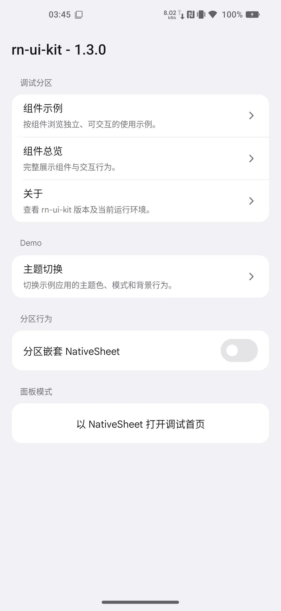
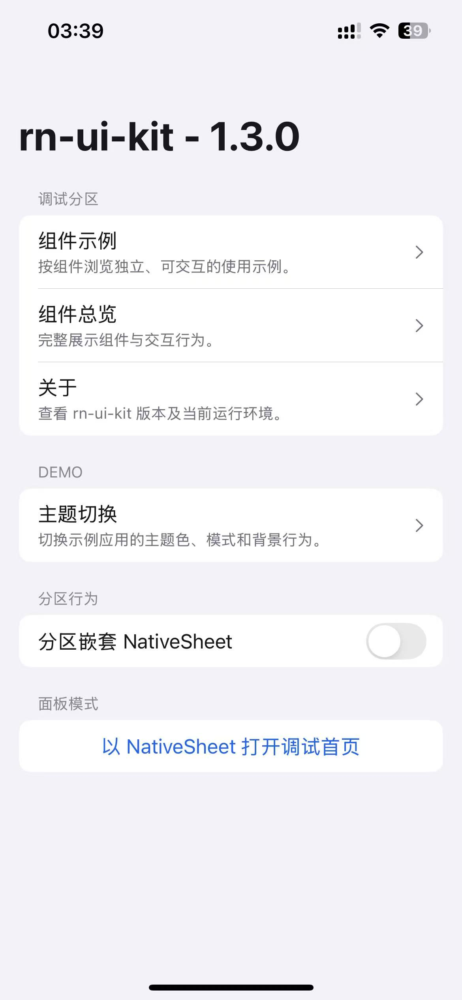
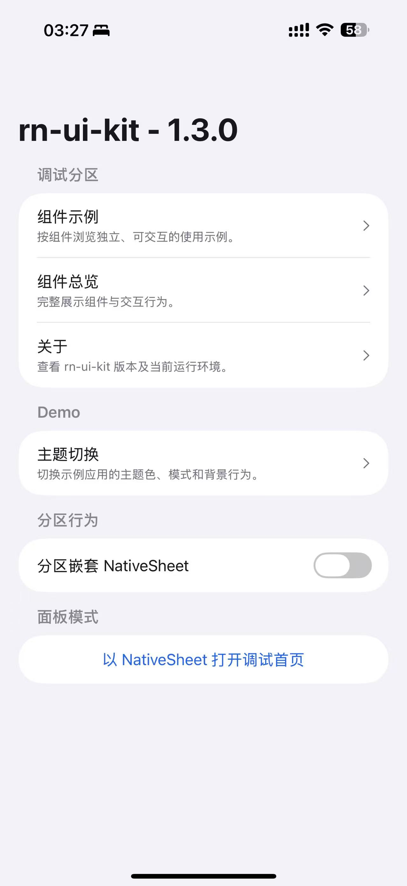

# rn-ui-kit

[中文](./README.md) · [English](./README_EN.md)

[在线示例 (web)](https://rn-ui-kit.luoluoqixi.com/)

面向 Expo、React Native 与 React Native Web 的跨平台 UI 封装库。`rn-ui-kit`
以 Tamagui 为基础，在同一套 API 下组合 Web 实现、React Native 实现与平台原生能力，
并提供主题、弹层、手势、安全区、Toast 和导航辅助能力。

> [!WARNING]
> 此库目前仅在我自己的部分 App 中使用，尚未准备作为面向所有人的通用 UI 库。
> 请勿假设其 API、兼容性或发布方式适用于其他项目。

## 特性

- 一套组件 API 覆盖 iOS、Android 和 Web
- 基于 Tamagui 的主题、Token、响应式样式与动画能力
- `RootProvider` 统一装配手势、安全区、Sheet、Toast、主题和原生对话框
- 支持浅色、深色、跟随系统以及自定义强调色主题
- 对 Menu、Select、Sheet、Toast、Haptics 等能力提供原生实现或跨平台降级
- 内置组件调试目录与 Expo 示例应用
- 通过 Bun patch 同步项目所需的上游依赖补丁
- 完整 TypeScript 类型导出

## 运行环境

本仓库当前锁定的主要技术版本如下：

| 技术 | 版本 |
| --- | --- |
| Expo | 55 |
| React Native | 0.83.9 |
| React / React DOM | 19.2.5 |
| Tamagui | 2.4.0 |
| TypeScript | 5.9.2 |
| 包管理器 | Bun |

`rn-ui-kit` 现在是单一 package：默认入口仅导出 core，debug API 需从
`rn-ui-kit/debug` 显式导入。运行时框架和原生模块统一声明在
根目录 [`package.json`](./package.json) 的
`peerDependencies` 中。接入已有应用时，请以该文件为准，并确保 Expo、React Native、
Tamagui 及原生模块版本兼容。


## 快速开始

### 运行仓库示例

```bash
bun install
bun install --cwd examples/app
bun run typecheck

# 启动 Expo 开发服务器
bun run --cwd examples/app start

# 或直接启动指定平台
bun run --cwd examples/app web
bun run --cwd examples/app android
bun run --cwd examples/app ios
```

Android 与 iOS 命令需要本机已配置相应的原生开发环境；Web 示例可以直接通过浏览器运行。

### 运行本地示例

仓库根目录就是 `rn-ui-kit` package；示例应用是独立 Bun 项目，通过本地目录依赖使用它：

```json
{
  "dependencies": {
    "rn-ui-kit": "file:../.."
  }
}
```

### 在外部项目中接入

本仓库使用 `rn-ui-kit-<version>` 分支保存编译后的独立发布包。发布分支不包含
workspace，也不要求外部 App 编译 TypeScript。推送发布分支后可以直接安装：

```bash
bun add github:luoluoqixi/rn-ui-kit#rn-ui-kit-<version>
```

私有仓库可以使用 SSH：

```bash
bun add "git+ssh://git@github.com/luoluoqixi/rn-ui-kit.git#rn-ui-kit-<version>"
```

外部项目仍需满足
[`peerDependencies`](./package.json) 中声明的 Expo、React Native、
Tamagui 和原生模块版本。

## 屏幕截图

| Android | iOS 18 | iOS 26 |
| :---: | :---: | :---: |
| <a href="./docs/SCREENSHOTS.md"></a> | <a href="./docs/SCREENSHOTS.md"></a> | <a href="./docs/SCREENSHOTS.md"></a> |

<p align="center">
  <a href="./docs/SCREENSHOTS.md">查看 Android、iOS 18 与 iOS 26 完整截图对比</a>
</p>

## 应用配置

### 1. 初始化平台能力

在应用入口的其他 UI 导入之前加载初始化模块：

```tsx
import "rn-ui-kit/initialize";
```

它会初始化 Tamagui 所需的手势、Zeego 菜单、原生 Toast、渐变、键盘控制、
Teleport Portal 和 Worklets 适配。

### 2. 配置 Tamagui

```tsx
// tamagui.config.ts
import { defaultConfig } from "@tamagui/config/v5";
import { animations } from "@tamagui/config/v5-css";
import { animations as animationsReanimated } from "@tamagui/config/v5-reanimated";
import { createTamagui, isWeb } from "tamagui";

import { themes } from "./themes";

const config = createTamagui({
  ...defaultConfig,
  animations: isWeb ? animations : animationsReanimated,
  themes,
});

export default config;

type AppConfig = typeof config;

declare module "tamagui" {
  interface TamaguiCustomConfig extends AppConfig {}
}
```

可直接参考示例中的
[`tamagui.config.ts`](./examples/app/tamagui.config.ts)、
[`themes.ts`](./examples/app/themes.ts) 和
[`tamagui.build.ts`](./examples/app/tamagui.build.ts)。

### 3. 添加根 Provider

```tsx
import "rn-ui-kit/initialize";

import { Button, RootProvider, Text } from "rn-ui-kit";
import { YStack } from "tamagui";

import config from "./tamagui.config";

export default function App() {
  return (
    <RootProvider
      tamaguiConfig={config}
      accentThemeName="ocean"
      accentThemeNames={["ocean", "sakura", "forest"]}
      preferences={{
        appearance: {
          accentColor: "ocean",
          backgroundFollowsTheme: false,
          themeMode: "system",
        },
      }}
    >
      <YStack flex={1} items="center" justify="center" gap="$4">
        <Text>你好，rn-ui-kit</Text>
        <Button onPress={() => console.log("pressed")}>开始使用</Button>
      </YStack>
    </RootProvider>
  );
}
```

`RootProvider` 会统一提供：

- `GestureHandlerRootView` 与 `SafeAreaProvider`
- Tamagui 主题上下文
- Sheet 与 Portal 支持
- Toast 渲染容器
- 原生对话框与触觉反馈上下文
- 颜色模式与强调色偏好

### 4. 配置 Babel 与 Web 样式

示例项目使用 `babel-preset-expo`、`@tamagui/babel-plugin` 和
`react-native-worklets/plugin`。完整配置见
[`babel.config.js`](./examples/app/babel.config.js)。

Web 端生成 Tamagui CSS 后，在入口导入：

```tsx
import "./tamagui.generated.css";
```

生成命令：

```bash
bun --cwd examples/app generate:tamagui
```

## 使用示例

### Toast

```tsx
import { Button, useToast } from "rn-ui-kit";

export function SaveButton() {
  const { toast } = useToast();

  return (
    <Button
      onPress={() =>
        toast.success("保存成功", {
          description: "配置已写入本地。",
        })
      }
    >
      保存
    </Button>
  );
}
```

### Dialog

```tsx
import { Button, Dialog, Text } from "rn-ui-kit";

export function ConfirmDialog() {
  return (
    <Dialog
      title="删除项目？"
      description="此操作无法撤销。"
      trigger={<Button>打开对话框</Button>}
      actions={
        <Dialog.Close asChild>
          <Button>确认</Button>
        </Dialog.Close>
      }
    >
      <Text>请确认你希望继续。</Text>
    </Dialog>
  );
}
```

### NativeList：iOS 原生列表

`NativeList` 在 iOS 上默认使用 `@expo/ui/swift-ui` 的原生 `List` 与 `Section`
渲染，并采用系统 `insetGrouped` 列表样式。导航行、选中标记、Switch 和 Select
会尽量使用 SwiftUI 控件，因此能够自然适配系统字体、颜色、交互反馈与滚动行为。

```tsx
import { useState } from "react";
import {
  NativeList,
  NativeListInputItem,
  NativeListItem,
  NativeListNavigationItem,
  NativeListSection,
  NativeListSelectItem,
  NativeListSwitchItem,
  NativeListTextAreaItem,
  Text,
} from "rn-ui-kit";

export function SettingsList() {
  const [autoSync, setAutoSync] = useState(true);
  const [themeMode, setThemeMode] = useState<string | null>("system");
  const [workspaceName, setWorkspaceName] = useState("rn-ui-kit");
  const [workspaceNote, setWorkspaceNote] = useState("");

  return (
    <NativeList>
      <NativeListSection title="名称" footer="编辑时会显示系统清除按钮。">
        <NativeListInputItem
          subtitle="显示在行尾的单行输入框"
          title="工作区名称"
          inputProps={{
            autoCapitalize: "none",
            onChangeText: setWorkspaceName,
            value: workspaceName,
          }}
        />
      </NativeListSection>
      <NativeListSection
        title="工作区"
        footer="更改会自动保存。"
        trailing={<Text color="$blue10">全部显示</Text>}
      >
        <NativeListNavigationItem
          sfSymbol="person.2.fill"
          iconColor="#7c3aed"
          title="成员"
          subtitle="邀请、角色与访问权限"
          titleFontSize={17}
          subtitleFontSize={13}
          onPress={() => console.log("open members")}
        />
        <NativeListItem
          chevron
          title="存储空间"
          trailing={<Text color="$color10">27.74 GB</Text>}
        />
        <NativeListSwitchItem
          title="自动同步"
          switchProps={{
            checked: autoSync,
            onCheckedChange: setAutoSync,
          }}
        />
        <NativeListSelectItem
          title="主题模式"
          selectProps={{
            value: themeMode ?? undefined,
            onValueChange: setThemeMode,
            options: [
              { label: "浅色", value: "light" },
              { label: "深色", value: "dark" },
              { label: "跟随系统", value: "system" },
            ],
          }}
        />
      </NativeListSection>
      <NativeListSection title="备注">
        <NativeListTextAreaItem
          textAreaProps={{
            numberOfLines: 4,
            onChangeText: setWorkspaceNote,
            value: workspaceNote,
          }}
        />
      </NativeListSection>
    </NativeList>
  );
}
```

需要注意：

- Android 和 Web 会自动使用基于 `FlashList` / React Native 视图的跨平台实现。
- 在 iOS 上传入 `<NativeList native={false}>`，可主动使用相同的 fallback 外观。
- `NativeList`、`NativeListSection` 与每个 Item 都支持 `contextMenuProps`，可直接传入
  `items`、`contentProps`、`itemProps`、打开事件等 `ContextMenu` 配置。解析优先级为
  Item > Section > NativeList；Item 或 Section 传 `contextMenuProps={false}` 可停止继承。
  iOS/Android 长按打开，Web 右键打开；编辑模式中会暂时停用，避免与多选手势冲突。
  `ContextMenuItemData` 支持 `icon`、`indicator`、`selected`、`subtitle`、`subMenu` 与
  `subMenuTitle`，其中 Android 原生菜单只支持一级子菜单。
- 向 `NativeList` 传入 `editMode` 可在 iOS、Android 与 Web 开启备忘录式多选：每行左侧
  显示选择标记，并将原行操作切换为选择/取消选择。列表可通过 `selectedIds` /
  `onSelectedIdsChange` 受控，也可仅传 `defaultSelectedIds` 使用内部状态；行可传
  `selectionId` 提供稳定标识。iOS 原生 List 默认使用 `iosEditModeVariant="native"`，由
  SwiftUI `List` 原生多选负责系统选择圆标、选中背景及滑动快速选择。传入
  `iosEditModeVariant="custom"` 可保留主题按下背景和现有的自定义选择实现；只有此模式会在
  iOS 使用 `editModeIcon` / `editModeSelectedIcon` 或优先使用 `editModeSfSymbol` /
  `editModeSelectedSfSymbol`。Android、Web 与 fallback 始终使用自定义实现，并继续支持
  React Native 自定义图标。
- 原生文本行的 `title`、`subtitle` 和 `value` 适合传入字符串或数字；无法直接映射到
  SwiftUI 的复杂 ReactNode 会按行降级渲染。
- 所有基础 Item 都支持 `titleColor` / `titleFontSize`、`subtitleColor` /
  `subtitleFontSize`、`valueColor` / `valueFontSize`。`NativeListSelectItem` 的已选值也会沿用
  `valueColor` 与 `valueFontSize`。
- 导航行及其他启用 chevron 的 Item 可通过 `chevronColor` 设置行尾箭头颜色；
  未指定时继续使用平台默认辅助色。
- fallback Item（包括 `NativeListCustomItem`）支持 `backgroundColor`、
  `hoverBackgroundColor` 与 `pressBackgroundColor`；iOS 原生 List 会忽略这些背景属性。
  未指定时继续使用原有的 fallback 主题颜色。
- 所有 Item（包括 `NativeListCustomItem`）支持 `paddingHorizontal`、
  `paddingVertical`、`paddingTop`、`paddingBottom`、`paddingLeft` 与
  `paddingRight`；单边属性优先于 Horizontal / Vertical。
- `icon` 用于自定义 React Native 图标；`sfSymbol` 用于 iOS 原生 SF Symbol，
  并可通过 `iconColor`、`iconSize` 调整。`sfSymbol` 在 fallback 模式中不渲染，
  两个字段可以同时传入：iOS 原生模式优先使用 `sfSymbol`，其他平台和 fallback
  模式使用 `icon`。
- `iconSlotWidth` 同时控制 iOS SF Symbol 和 fallback 自定义图标的列宽。iOS 原生模式
  默认取 `Math.max(24, iconSize ?? 20)`；fallback 未指定时保留自定义图标自身宽度。
  多行可设置相同的 `iconSlotWidth` 以保持标题左边缘对齐。
- `NativeListSection` 支持 `titleColor` 与 `titleFontSize`；复杂 ReactNode 标题仍由调用方
  自行设置文本样式。
- iOS `NativeListSelectItem` 会把 `NativePickerSwiftUI` 接口已声明的 picker 属性完整传入，
  包括 dropdown 对齐/偏移、原生 trigger 样式与内容、`onOpenChange`；具体行为沿用
  `NativePickerSwiftUI` 的现有实现。仅属于 Web、Tamagui viewport 或自定义 Sheet 的
  `SelectProps` 不适用于这条原生 picker 路径。
- `NativeListCustomItem` 可在原生列表中承载自定义 React Native 内容。
- `NativeListInputItem` 提供占满一行的单行输入框，使用 `inputProps` 传入 `Input` 的
  `value`、`onChangeText`、`placeholder`、`autoFocus` 等属性；传入 `title` 或 `subtitle`
  时，文本显示在左侧、输入框显示在右侧。默认在 iOS 编辑时显示清除按钮；传入
  `inputProps.clearButtonMode` 可以覆盖该行为。Web fallback 的输入框背景默认透明，可通过
  `inputProps.style.backgroundColor` 显式覆盖。NativeList 编辑模式会将 iOS 单行与多行输入框
  显示为只读的 SwiftUI 文本快照，保留当前值或占位文字，同时将整行点击交给多选行为。
- `NativeListItem.trailing` 可渲染自定义行尾内容；`NativeListSection.trailing` 可渲染分组
  标题右侧内容，例如“全部显示”。iOS 15 会将包含复杂 React Native trailing 的 header
  放入 Section 的透明首行，并为首个内容行恢复顶部圆角，以绕开系统 section header 的复用问题。
- `NativeListTextAreaItem` 提供占满一行的多行文本框，使用 `textAreaProps` 传入 `TextArea`
  的属性。
- `initialScrollTarget` 与行上的 `nativeScrollId` 可用于 iOS 原生列表的初始滚动定位。

完整交互示例见
[`collection_examples.tsx`](./src/debug/pages/component_examples/examples/collection_examples.tsx)。

## 组件

| 分类 | 组件 |
| --- | --- |
| 操作与反馈 | `Button`、`Checkbox`、`Switch`、`ToggleGroup`、`Slider`、`Spinner`、`Progress`、`Toast`、`NativeDialog` |
| 表单 | `Input`、`TextArea`、`Select`、`RadioGroup`、`Form`、`Label` |
| 布局与组合 | `Accordion`、`Tabs`、`SplitView` / `SplitLayout`、`Card` |
| 弹层 | `Dialog`、`AlertDialog`、`ContextMenu`、`Menu`、`Popover`、`Sheet` / `NativeSheet`、`Tooltip` |
| 列表与滚动 | `NativeList`、`ListGroup`、`ListItem`、`FlashList`、`ScrollView` |
| 展示 | `Avatar`、`Text`、`Image`、`Separator`、`Link` |
| 基础设施 | `RootProvider`、`UIProvider`、主题工具、导航工具、Portal 与平台工具 |

所有公开导出可在
[`src/core/components/ui/index.ts`](./src/core/components/ui/index.ts)
中查看。各组件目录同时导出 Props 类型。

## 补丁同步

该库依赖少量上游补丁。应用安装依赖后运行：

```bash
bun run sync-patches
```

对应的应用脚本为：

```json
{
  "scripts": {
    "sync-patches": "rn-ui-sync-patches"
  }
}
```

命令会将库内补丁复制到应用的 `patches/` 目录，并注册到应用
`package.json` 的 `patchedDependencies`。如果应用需要保留自己的某个补丁，可以排除
同名依赖：

```json
{
  "rnUiKitSyncPatches": {
    "exclude": ["@expo/cli@55.0.32"]
  }
}
```

被排除的依赖不会被复制或注册。

## 项目结构

```text
rn-ui-kit/
├─ src/
│  ├─ core/               # 核心组件、Provider、主题与平台适配
│  ├─ debug/              # 组件目录、调试页面与示例界面
│  ├─ index.ts            # 默认入口，仅导出 core
│  ├─ debug.ts            # rn-ui-kit/debug 子路径
│  └─ initialize.ts       # rn-ui-kit/initialize 子路径
├─ patches/               # 需要同步到 App 的上游补丁
├─ deprecated_patches/    # 已停用补丁归档
├─ test/                  # 测试与公开 API 类型检查
├─ examples/
│  └─ app/                # Expo iOS / Android / Web 示例应用
├─ scripts/
│  ├─ sync-patches.mjs    # rn-ui-sync-patches
│  ├─ android/            # 构建并发布 Android 示例 APK
│  └─ release/            # 版本同步、发布包与发布分支脚本
├─ package.json           # 库 manifest、构建与发布命令
└─ bun.lock
```

## 开发

```bash
# 编译 rn-ui-kit 到 dist
bun run build

# 检查 package 和示例 App
bun run typecheck

# 仅检查 rn-ui-kit
bun run typecheck:library

# 仅检查示例应用
bun run --cwd examples/app typecheck
```

新增或修改组件时，建议同时在 `src/debug` 的组件目录中添加示例，
以便在 iOS、Android 和 Web 上核对交互与视觉表现。

## 构建与发布

```bash
# 修改版本并同步 bun.lock
bun run set-version 1.0.1

# 更新版本、创建签名 commit 和 tag
# 要求执行前工作区干净
bun run set-version 1.0.1 --commit

# 明确允许将已有工作区改动一并提交
bun run set-version 1.0.1 --commit --force

# 完成上述步骤、生成发布分支并推送到 origin/nas
bun run set-version 1.0.1 --push

# 只生成发布目录和 tarball
bun run package-release --pack-only

# 生成发布目录、tarball 和本地 rn-ui-kit-1.0.1 分支
bun run package-release

# 确认后推送发布分支
git push -u origin rn-ui-kit-1.0.1
```

发布阶段直接编译根目录 package，不会动态合并 package。发布分支根目录只包含
编译后的 `dist`、package.json、README、LICENSE、patches 和运行时脚本。完整说明见
[`scripts/release/README.md`](./scripts/release/README.md)。

## License

[MIT](./LICENSE) © 2026 luoluoqixi
